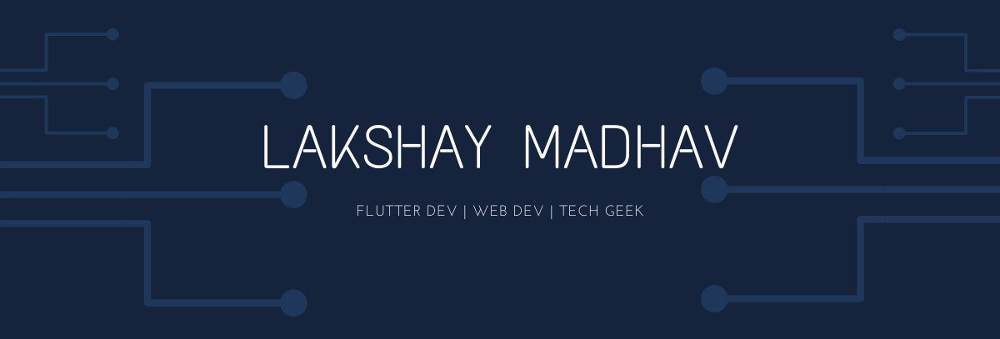

  

<h1  align="center">Hi 👋, I'm Lakshay Madhav</h1>

<h3  align="center">A Tech nerd who is passionate about tech gadgets and stuff</h3>

  

   

   

 
- 🌱 I’m currently learning <b>Data Science</b>
 
- 💬 Ask me about <b>Flutter, Html, CSS, JS</b>

<h3  align="center">Connect with me:</h3>

  

<h3  align="center">Languages :</h3>

 
  
   
   
  <a  href="https://developer.mozilla.org/en-US/docs/Web/JavaScript"  target="_blank">  
   
  
   
   
  

  
 <h3  align="center">Tools and Frameworks :</h3>

<h3  align="center">Databases :</h3>

 

  

<h3  align="center">Github Status :</h3>

